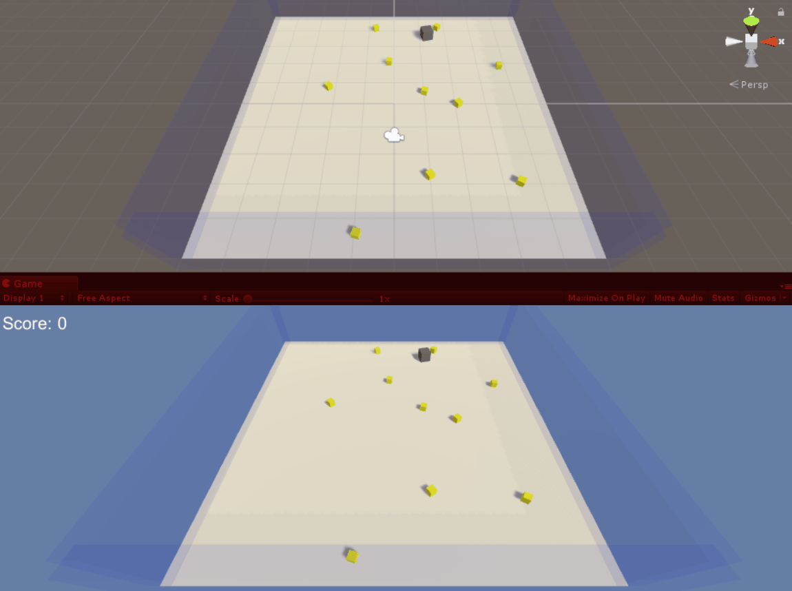

# Whiteboxing-UnityMLAgents
Experimental testbed where I test various Machine Learning & AI concepts using Unity ML Agents. Note that this is a work in progress that I am sharing "as is" as I build and expand new ML scenarios.

**Unity version:** 2018.1.0b13 (beta)
**Unity ML-Agents version:** 0.3.1a

## Environments
**Rat & Cheese (single):** The rat (gray ball) should run to the piece of cheese (yellow cube). The rat is given the relative position of the cheese in relationship to itself. Agent Reward Function: 
* +0.1 if getting closer.
* -0.05 time penalty.
* +1.0 when reaching target.

**Rat & Cheese (multiple cheese):** The rat (gray cube) collects all the pieces of cheese (yellow cube) on the board. The rat does not know where the cheese pieces are, it uses raycasts to detect the cheese as it moves around. Agent Reward Function: 
* -0.2 penalty if the rat hits a wall.
* -0.005 time penalty.
* +1.0 when reaching a piece of cheese.

## Project Setup
* The [TensorflowSharp](https://github.com/Unity-Technologies/ml-agents/blob/master/docs/Background-TensorFlow.md#tensorflowsharp) plugins folder was omitted from this project due to the massive file sizes. You will need to import this set of Unity plugins yourself. You can download the TensorFlowSharp plugin as a [Unity package here](https://s3.amazonaws.com/unity-ml-agents/0.3/TFSharpPlugin.unitypackage).
* There is currently a bug where if you use all the duplicate platforms for training, all the rats & cheese will spawn on the same platform since the initial spawn values are hard-coded and not relative to each board. regardless, it does not affect the training as they all still run independently from one another.

## Follow Me
* Twitter: [@ActiveNick](http://twitter.com/ActiveNick)
* Blog: [AgeofMobility.com](http://AgeofMobility.com)
* SlideShare: [http://www.slideshare.net/ActiveNick](http://www.slideshare.net/ActiveNick)
